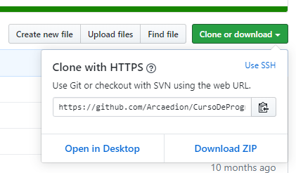

[](https://discord.gg/kEjJ8ax) [](https://www.youtube.com/channel/UC1s2NpVU-gw8_v3VR3RPZSg)

# Crafting Repo
Tutoriais sobre arrastar e soltar e sistema de craft em Unity

## Servidor do Discord

Dúvidas? Procure ajuda no nosso Discord: https://discord.gg/kEjJ8ax

## Modo de uso desse repositório

As pastas estão divididas em Aulas e AulasExtra. As aulas extras são assuntos importantes mas não são totalmente necessárias, enquanto que as aulas são a parte importante deste repositório

## Como Aproveitar este Código

## 1. Baixe a última versão do Git para seu sistema operacional em:

https://git-scm.com/downloads


### 2. Após a instalação, você tem algumas opções dependendo do que pretende fazer: Fork ou Clone

#### 1. Fork no Github (precisa de uma conta Github)

Ao realizar um fork, você cria uma cópia pública do repositório no seu perfil. Com isso, você tem um repositório e pode fazer commits para ele para evitar perder alterações na sua versão modificada do código. Você pode fazer um pull request da sua versão do jogo e nós a disponibilizamos na forma de uma branch para outras pessoas verem sua criação.

Se o seu pull request for um bug fix, deixe claro na mensagem que iremos verificar as mudanças.

Para realizar um fork, entre na URL do repositório e clique no botão "fork".


Após o fork, você pode fazer clone para seu diretório (veja abaixo).

P.S.: Criar fork's colabora para a relevância do projeto para quem pesquisa pelo Github.

#### 2. Clone (com ou sem conta Github)

Um clone cria uma cópia local e privada de um repositório. Ideal se você quiser testar o código localmente. Você pode realizar alterações e salvar em um repositório seu privado ou público.

Para realizar um clone, selecione "Clone or download" no topo do repositório e copie o URL que estiver demonstrado



No seu sistema operacional, crie um diretório para guardar seus projetos. Abra um terminal e escreva o comando

```
cd caminho/para/sua/pasta
```

Por exemplo, no Windows, você poderia guardar seus projetos em C:\Projetos, o comando ficaria

```
cd C:\Projetos
```

O caminho do terminal irá mudar para sua pasta. Agora você pode fazer um clone.

```
git clone https://github.com/Arcaedion/CursoDeProgramacao.git
```

Caso você tenha seu próprio repositório e tenha feito alterações a ele, você pode fazer commit para realizar modificações locais e push para enviar para o repositório remoto. Sendo assim, quando estiver pronto para fazer commit, faça 

```
git add --all
```

Para adicionar todas as modificações à lista de modificações. Depois

```
git commit -m "Sua mensagem de commit"
```

Onde você pode customizar sua mensagem de commit para explicar o que você alterou

E por fim

```
git push
```

Para enviar as alterações para o repositório remoto. Nesse momento, se for a primeira vez que você estiver fazendo Push, uma tela de login aparecerá para você logar na sua conta Github.

Para mais informações, acesse (em inglês): https://www.earthdatascience.org/workshops/intro-version-control-git/basic-git-commands/

P.S.: Você pode opcionalmente apenas fazer download do zip do projeto.

### 3. Porque manter uma conta no Github? 

Você pode realizar alterações em seu projeto e guardar em um repositório, seja para controle de versão ou para ter backups do seu código. 

Uma conta do Github ativa colabora muito para seu futuro pois é uma mais valia para empresas que pretendem contratar. Mesmo que você não trabalhe com jogos, toda a experiência em programação é valorizada. Após criar uma conta no github e realizar um clone
        

